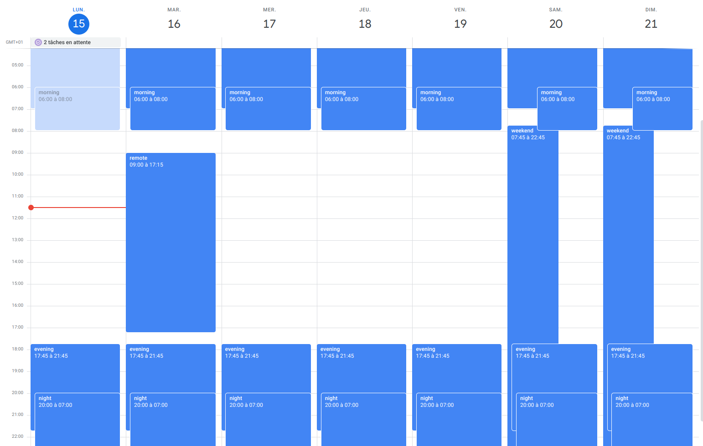
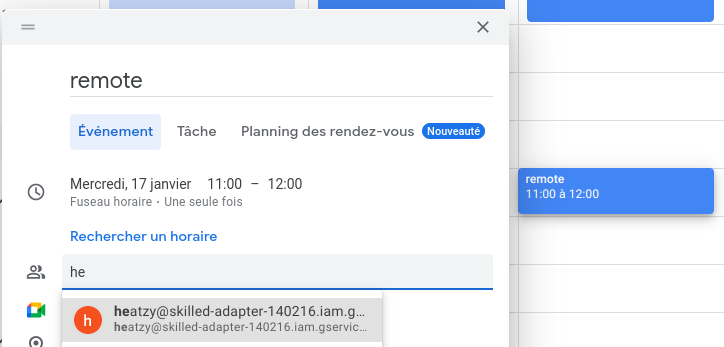

# HeatGCalController
- Developer: Thomas GSP
- Version: 0.1 dev

### Manage your Heatzy Pilote and Nobis stove through Google Calendar
This software allow to fully manage Heatzy Pilots devices with Google calendar.

Define different modes, like `weekend`, `remote`, invite the google service_account and let it manage heaters for you !
You can still manage your devices through the official app, for a last minute change. 
In this case, the official all get the priority during a pre-defined delay.

- Gain in flexibility and management

**Limitations**:
The system use heatzy api endpoint and google calendar api.
A stable network connection is required.

### Features
- Heaters are individually managed
- Priority system in case of conflict on the hours (low value is the more high priority)

### Setup HeatZyGCalendar 
In the `./configs` folder:
- File `configs.yaml`: Global configuration file.
- File `modes.yaml`: Heaters configuration.
- File `sequences.yamm`: Not implemented, will manage the sequence of heaters.

In the `./credential` folder:
- File `credentials_google.json`: Google service_account credentials, see below to make it.
- File `credentials_heatzy.json`: Json containing credentials for Heatzy (your heatzy credential)

### Setup Google Service Account
You need to setting-up a service account with calendar API: https://cloud.google.com/iam/docs/service-accounts-create  

### How to invite my service account ?
Connect to your Google Calendar, create a new event with the name of the configuration 'eg: remote', and invite the service account with the email provide by google.

eg: `heatzy@skilled-adapter-12345.iam.gserviceaccount.com`

Note: 
- You should deactivate reminder, to avoid to be flooded by notification on your google calendar account.
- Google service account do not need to accept the invitation.
- To cancel a schedule, just delete-it.

### Next features:
- Possibility to make a group of heaters (eg: living_room)
- Sequence system to make specific programmation (CONFORT during 30Min and ECO during 10 ...)
- Possibility to run outside docker (self packaged app).
- Possibility to run through dedicated master service (no systemd services & timers)

### Run for dev / test
- And `docker-compose -f docker-compose-dev.yaml up get_schedules` # Will get schedule configuration on Google calendar.
- And `docker-compose -f docker-compose-dev.yaml up set_heaters` # Will set the heaters according schedules and configuration.

### Requirements for production:
- A debian/ubuntu server (onpremise or cloud), with http/https (80/443) OUTPUT allowed.
- docker & docker-compose installed
- yq installed

### Install (debian/ubuntu server)
- Copy the file directory to your server.
- Run makefile ( `make install` ) will: 
  - Create a specific user to run the software.
  - Copy the files in installation directory.
  - Install system.d services and timers.
  
- You can change the installation directory with the parameter `INSTALL_PATH` and `INSTALL_CONFIG_PATH`
Defaults: 
- `INSTALL_PATH` = /opt/heatzy/pilotes/google-calendar
- `INSTALL_CONFIG_PATH` = /etc/heatzy/pilotes/google-calendar