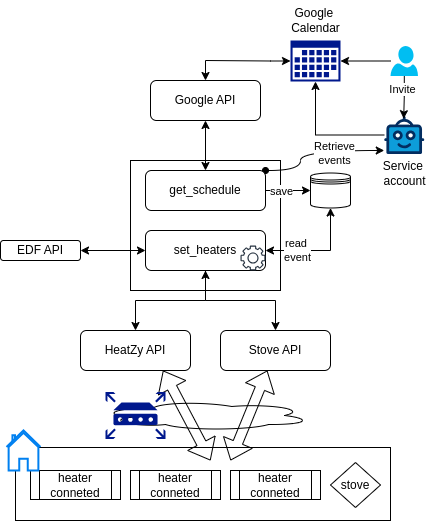

## HeatZyGCalendar: Automate Your Heating with Google Calendar

This open-source project, **HeatGCalController**, is designed to give you greater control and flexibility over managing your **Heatzy Pilote** devices 
and **stoves** (e.g., Nobis) by integrating their schedules with **Google Calendar**. 

The project is in a **stable version** and is ready for use! 

It's hosted on [GitHub](#), where you can find the full source code.

### Why use HeatGCalController?

#### Save money on energy bills
- By automating the management of your heating devices with smart scheduling through Google Calendar,
you can easily optimize energy usage.
- A single point of management for different system.
- Schedule your heaters to run only when necessary and avoid unnecessary heating during off-peak hours or when you're away.
- With **EDF Tempo subscription support**, you can also optimize heating based on energy tariffs, helping you save even more.

A **Proper scheduling of electric heaters and stoves** is key to reducing energy consumption, and **HeatGCalController** makes this easy with Google Calendar. 

If you're subscribed to **EDF Tempo** (a dynamic energy pricing model in France), this tool helps you optimize energy usage based on daily tariffs:
- [x] **Red Days** (high tariffs): Automatically switch off devices during peak cost periods.
- [ ] **White Days** (mid-range tariffs): Maintain a balanced heating schedule that meets comfort needs without excessive energy use.
- [ ] **Blue Days** (low tariffs): Take advantage of low-cost energy by scheduling more comfortable heating settings during these days.


### Seamless integration with Google Calendar
Unlike the native Heatzy app & Nobis (or other stove), using Google Calendar offers these advantages:

- **Easy Scheduling**: You already use Google Calendar for daily planning, so integrating heater management is simple and convenient. Just create an event like you would for any meeting or reminder.
- **Flexible Modes**: Define modes such as "weekend", "vacation", or "remote" and let the system handle the rest. Changes to your heating schedule are as easy as modifying an event in your calendar.
- **Collaborative Control**: Invite other household members to manage schedules as needed. This is especially useful for shared homes or rental properties.
- **Offline Support**: Even when you don’t have direct access to your devices, you can still manage their schedule remotely via Google Calendar.

### Manual Control Remains
Even with automated scheduling, manual control through the official Heatzy app is still possible. 

If you need to make last-minute changes, simply use the app, and it will take priority over the schedule for a pre-defined duration, ensuring flexibility.

## Features Overview

- [x] **Individual Device Management**: Each heater is managed separately, giving you granular control over your devices.
- [x] **Priority Conflict Handling**: If two modes overlap, the one with the higher priority (lower value) will take precedence, ensuring the most important event is handled correctly.
- [x] **Serverless and Local Options**: You can run this system locally, via Docker Compose, or in a serverless setup with GitHub Actions and S3 for data storage (configuration, cache, etc.).
- [x] **Compatible with EDF Tempo**: This feature allows optimization for French electricity customers using the EDF Tempo pricing model, which encourages reduced energy consumption during peak periods.
- [ ] **Weather adapter**: Schedule automatically depending on weather


### Usage Example: Weekend Mode

Imagine setting up a "Weekend" mode for your heaters:

1. Open Google Calendar.
2. Create a recurring event for every weekend, titled "Weekend".
3. Invite the Google service account email (e.g., `heatzy@skilled-adapter-12345.iam.gserviceaccount.com`).
4. The system will automatically adjust your heaters to a more comfortable setting for the weekend based on your defined "Weekend" mode in the configuration file.

Similarly, you could have a "Vacation" mode for periods when you're away, ensuring your heaters run at minimal levels to avoid waste.

### Usage Example 2 : Vacation Mode
You have defined a "Weekend" mode, with heaters turning "ON".  
You don't need to cancel this mode, just create invitation "Vacation", with a higher priority to override the weekend configuration. 

### Limitations to Consider
- **Stable Network Required**: Since the system relies on both the **Heatzy API** and **Google Calendar API**, a reliable internet connection is necessary to ensure proper functionality.
- **Dependent on Third-Party Services**: Any outages or changes in the Google Calendar API or Heatzy API might affect the system's performance.
- **Learning Curve**: Setting up the service account and customizing the configuration files requires some initial technical knowledge.

### How to Get Started locally

#### Step 1: Configuration Files
1. **Global Configuration**:
   - Copy the `.example` file to `main.yaml` in the `./configs` folder and adjust the global settings.
   - As you want to use it locally, make sure to change the credential format 
     - eg: `credentials: env://GOOGLE_CREDENTIALS` as `credentials: file://credentials/credentials_google.json`
     - And all the other local path `mnt/s3/outputs/schedules.json` -> `outputs/schedules.json`
   - If you do not user a stove/edf tempo, just disable the option `enabled: true` -> `enabled: false`
2. **Heater Modes**:
   - Copy the `.example` file to `modes.yaml` in the `./configs` folder to define specific modes for your heaters.

#### Step 2: Credential Files
1. **Google Service Account**: 
   - Set up a service account following [Google's official guide](https://cloud.google.com/iam/docs/service-accounts-create), and save the credentials as `credentials_google.json`.
2. **Heatzy and Stove Credentials**:
   - Provide your Heatzy and stove credentials in `credentials_heatzy.json` and `credentials_stove.json`, respectively.

#### Step 3: Use docker compose
1. Build the image:
   - ```docker-compose build```
2. Start it:
   - ```docker-compose up app```

### How to Get Started Severless
1. Fork & configure this repository (to access to GitHub action)
2. Create AWS (or equivalent) account and a IAM user with ACCESS/SECRET KEY
3. Create a S3 bucket
4. Add the "Secrets & Variable" to your repository
   - AWS_ACCESS_KEY_ID
   - AWS_SECRET_ACCESS_KEY
   - AWS_REGION
   - S3_BUCKET_NAME
   - GOOGLE_CREDENTIALS (with your value as json)
   - HEATZY_CREDENTIALS (with your value as json)
   - STOVE_CREDENTIALS (with your value as json)
   
5. Configure the workflow (or run in manually) to start


### Contributions Are Welcome!

This project is open-source and thrives on community collaboration. 
Whether you're interested in improving the code, adding new features, or fixing bugs, 
contributions are encouraged and appreciated! 

Feel free to submit a pull request or raise an issue on GitHub.

#### Libraries included:
https://github.com/fredericvl/py-agua-iot ( & list of all stove brands taken in charge)

#### Simplified schema:
